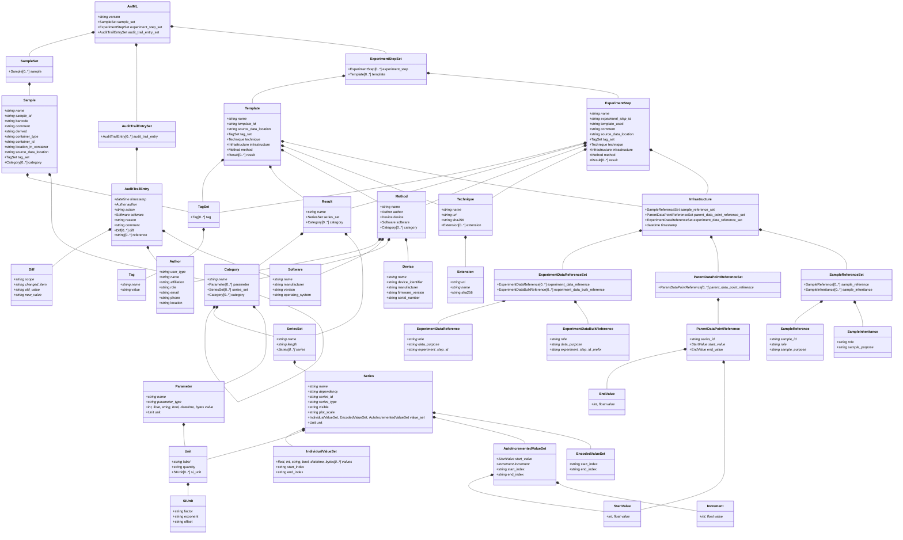

```mermaid
classDiagram
    AnIML *-- SampleSet
    AnIML *-- AuditTrailEntrySet
    AnIML *-- ExperimentStepSet
    SampleSet *-- Sample
    AuditTrailEntrySet *-- AuditTrailEntry
    ExperimentStepSet *-- Template
    ExperimentStepSet *-- ExperimentStep
    Sample *-- TagSet
    Sample *-- Category
    AuditTrailEntry *-- Diff
    AuditTrailEntry *-- Author
    AuditTrailEntry *-- Software
    Template *-- TagSet
    Template *-- Result
    Template *-- Method
    Template *-- Technique
    Template *-- Infrastructure
    ExperimentStep *-- TagSet
    ExperimentStep *-- Result
    ExperimentStep *-- Method
    ExperimentStep *-- Technique
    ExperimentStep *-- Infrastructure
    TagSet *-- Tag
    Result *-- Category
    Result *-- SeriesSet
    Method *-- Author
    Method *-- Software
    Method *-- Category
    Method *-- Device
    Technique *-- Extension
    Infrastructure *-- ExperimentDataReferenceSet
    Infrastructure *-- ParentDataPointReferenceSet
    Infrastructure *-- SampleReferenceSet
    Category *-- Category
    Category *-- SeriesSet
    Category *-- Parameter
    ExperimentDataReferenceSet *-- ExperimentDataReference
    ExperimentDataReferenceSet *-- ExperimentDataBulkReference
    ParentDataPointReferenceSet *-- ParentDataPointReference
    SampleReferenceSet *-- SampleReference
    SampleReferenceSet *-- SampleInheritance
    SeriesSet *-- Series
    Parameter *-- Unit
    ParentDataPointReference *-- EndValue
    ParentDataPointReference *-- StartValue
    Series *-- IndividualValueSet
    Series *-- Unit
    Series *-- AutoIncrementedValueSet
    Series *-- EncodedValueSet
    Unit *-- SIUnit
    AutoIncrementedValueSet *-- StartValue
    AutoIncrementedValueSet *-- Increment
    
    class AnIML {
        +string version*
        +SampleSet sample_set
        +ExperimentStepSet experiment_step_set
        +AuditTrailEntrySet audit_trail_entry_set
    }
    
    class SampleSet {
        +Sample[0..*] sample
    }
    
    class AuditTrailEntrySet {
        +AuditTrailEntry[0..*] audit_trail_entry
    }
    
    class ExperimentStepSet {
        +ExperimentStep[0..*] experiment_step
        +Template[0..*] template
    }
    
    class Sample {
        +string name*
        +string sample_id*
        +string barcode
        +string comment
        +string derived
        +string container_type
        +string container_id
        +string location_in_container
        +string source_data_location
        +TagSet tag_set
        +Category[0..*] category
    }
    
    class AuditTrailEntry {
        +datetime timestamp*
        +Author author*
        +string action*
        +Software software
        +string reason
        +string comment
        +Diff[0..*] diff
        +string[0..*] reference
    }
    
    class Template {
        +string name*
        +string template_id*
        +string source_data_location
        +TagSet tag_set
        +Technique technique
        +Infrastructure infrastructure
        +Method method
        +Result[0..*] result
    }
    
    class ExperimentStep {
        +string name*
        +string experiment_step_id*
        +string template_used
        +string comment
        +string source_data_location
        +TagSet tag_set
        +Technique technique
        +Infrastructure infrastructure
        +Method method
        +Result[0..*] result
    }
    
    class Diff {
        +string scope*
        +string changed_item*
        +string old_value*
        +string new_value*
    }
    
    class Author {
        +string user_type*
        +string name*
        +string affiliation
        +string role
        +string email
        +string phone
        +string location
    }
    
    class Software {
        +string name*
        +string manufacturer
        +string version
        +string operating_system
    }
    
    class TagSet {
        +Tag[0..*] tag
    }
    
    class Result {
        +string name*
        +SeriesSet series_set
        +Category[0..*] category
    }
    
    class Method {
        +string name
        +Author author
        +Device device
        +Software software
        +Category[0..*] category
    }
    
    class Technique {
        +string name*
        +string uri*
        +string sha256
        +Extension[0..*] extension
    }
    
    class Infrastructure {
        +SampleReferenceSet sample_reference_set
        +ParentDataPointReferenceSet parent_data_point_reference_set
        +ExperimentDataReferenceSet experiment_data_reference_set
        +datetime timestamp
    }
    
    class Tag {
        +string name*
        +string value
    }
    
    class Category {
        +string name*
        +Parameter[0..*] parameter
        +SeriesSet[0..*] series_set
        +Category[0..*] category
    }
    
    class Device {
        +string name*
        +string device_identifier
        +string manufacturer
        +string firmware_version
        +string serial_number
    }
    
    class Extension {
        +string uri*
        +string name*
        +string sha256
    }
    
    class ExperimentDataReferenceSet {
        +ExperimentDataReference[0..*] experiment_data_reference
        +ExperimentDataBulkReference[0..*] experiment_data_bulk_reference
    }
    
    class ParentDataPointReferenceSet {
        +ParentDataPointReference[0..*] parent_data_point_reference*
    }
    
    class SampleReferenceSet {
        +SampleReference[0..*] sample_reference
        +SampleInheritance[0..*] sample_inheritance
    }
    
    class SeriesSet {
        +string name*
        +string length*
        +Series[0..*] series*
    }
    
    class Parameter {
        +string name*
        +string parameter_type*
        +int, float, string, bool, datetime, bytes value*
        +Unit unit
    }
    
    class ExperimentDataReference {
        +string role*
        +string data_purpose*
        +string experiment_step_id*
    }
    
    class ExperimentDataBulkReference {
        +string role*
        +string data_purpose*
        +string experiment_step_id_prefix*
    }
    
    class ParentDataPointReference {
        +string series_id*
        +StartValue start_value*
        +EndValue end_value
    }
    
    class SampleReference {
        +string sample_id*
        +string role*
        +string sample_purpose*
    }
    
    class SampleInheritance {
        +string role*
        +string sample_purpose*
    }
    
    class Series {
        +string name*
        +string dependency*
        +string series_id*
        +string series_type*
        +string visible
        +string plot_scale
        +IndividualValueSet, EncodedValueSet, AutoIncrementedValueSet value_set
        +Unit unit
    }
    
    class SIUnit {
        +string factor
        +string exponent
        +string offset
    }
    
    class EndValue {
        +int, float value*
    }
    
    class IndividualValueSet {
        +float, int, string, bool, datetime, bytes[0..*] values*
        +string start_index
        +string end_index
    }
    
    class Unit {
        +string label*
        +string quantity
        +SIUnit[0..*] si_unit
    }
    
    class AutoIncrementedValueSet {
        +StartValue start_value*
        +Increment increment*
        +string start_index
        +string end_index
    }
    
    class EncodedValueSet {
        +string start_index
        +string end_index
    }
    
    class StartValue {
        +int, float value*
    }
    
    class Increment {
        +int, float value*
    }
    
```